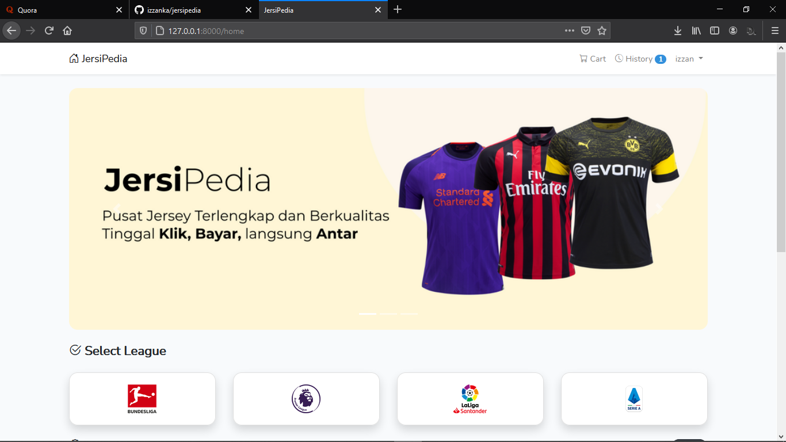
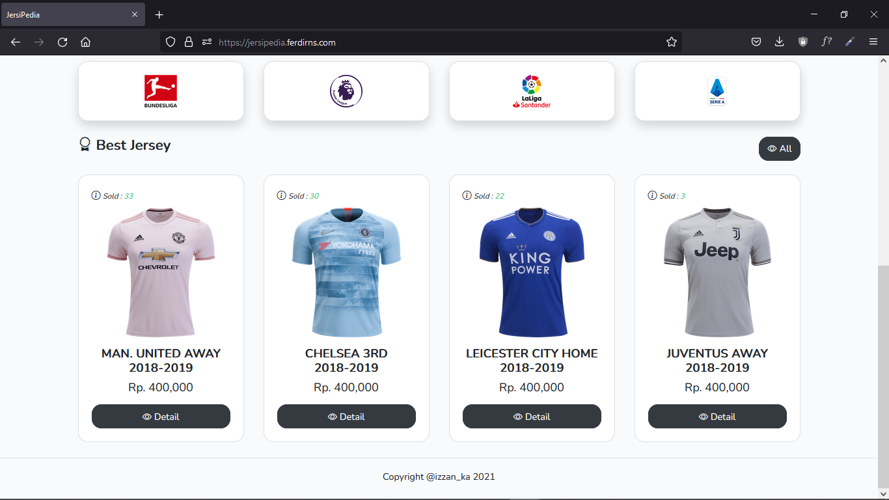
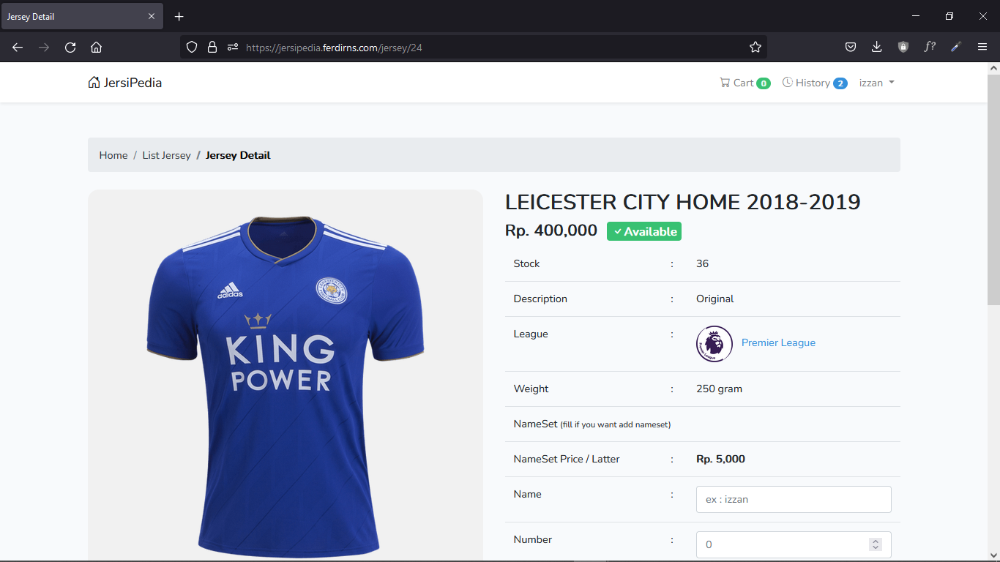
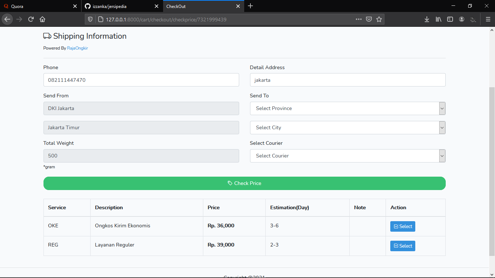
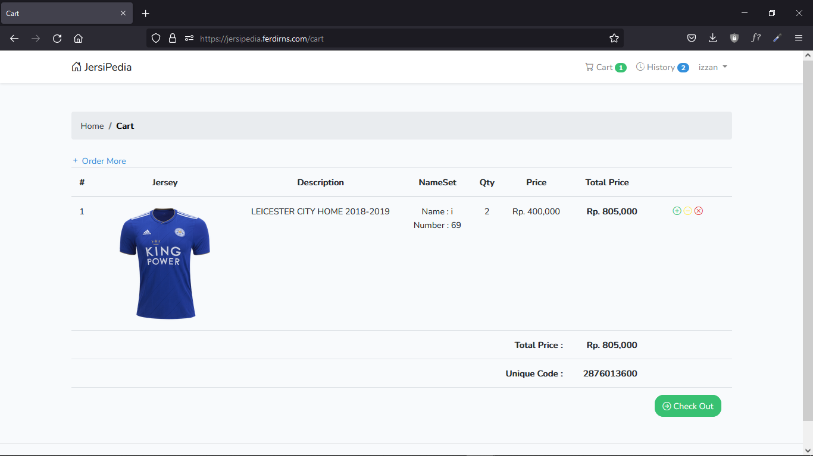
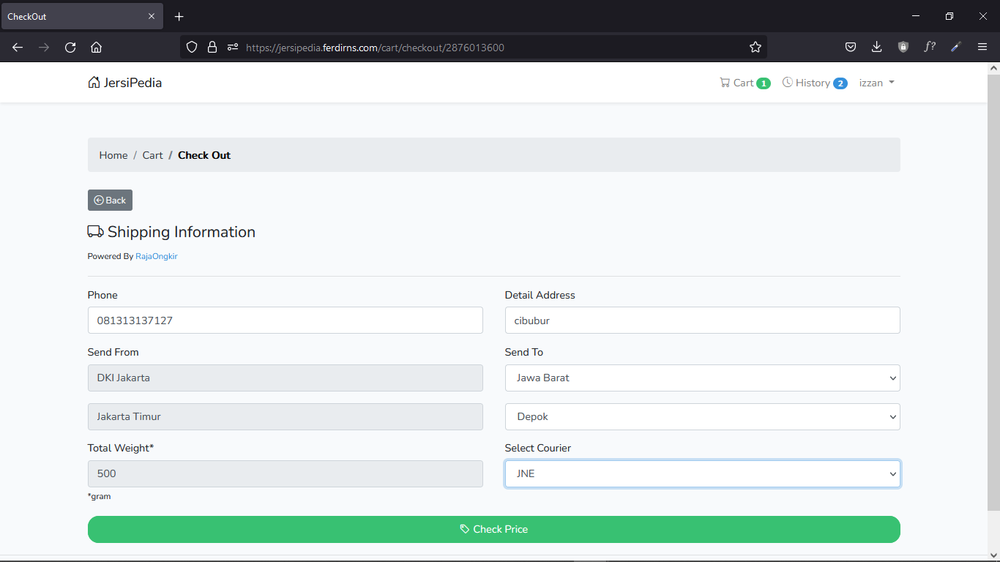

<!-- PROJECT LOGO -->
<p align="center">
  <h3 align="center">JERSIPEDIA</h3>
</p>

<!-- ABOUT -->
## About

## Built With

### Framework

* [Laravel](https://laravel.com)
* [Bootstrap](https://getbootstrap.com)

### Library

* [JQuery](https://jquery.com)

### Api

* [RajaOngkir](https://rajaongkir.com)

### Package

* [maatwebsite/excel](https://github.com/Maatwebsite/Laravel-Excel)
* [spatie/image](https://github.com/spatie/image)

<!-- GETTING STARTED -->
## Getting Started

### Installation

* Clone the repo, then enter the project directory with terminal
```sh
composer install
```
```sh
cp .env.example .env
```
```sh
php artisan key:generate
```
* Create new database, then change the .env
```sh
php artisan migrate
```
* Dummy data 
```sh
php artisan db:seed --class=LeagueSeeder
```
```sh
php artisan db:seed --class=JerseySeeder
```
```sh
php artisan db:seed --class=UserSeeder
```
* Run
```sh
php artisan serve
```

<!-- USAGE EXAMPLES -->
## Usage

* Website : https://jersipedia.000webhostapp.com









